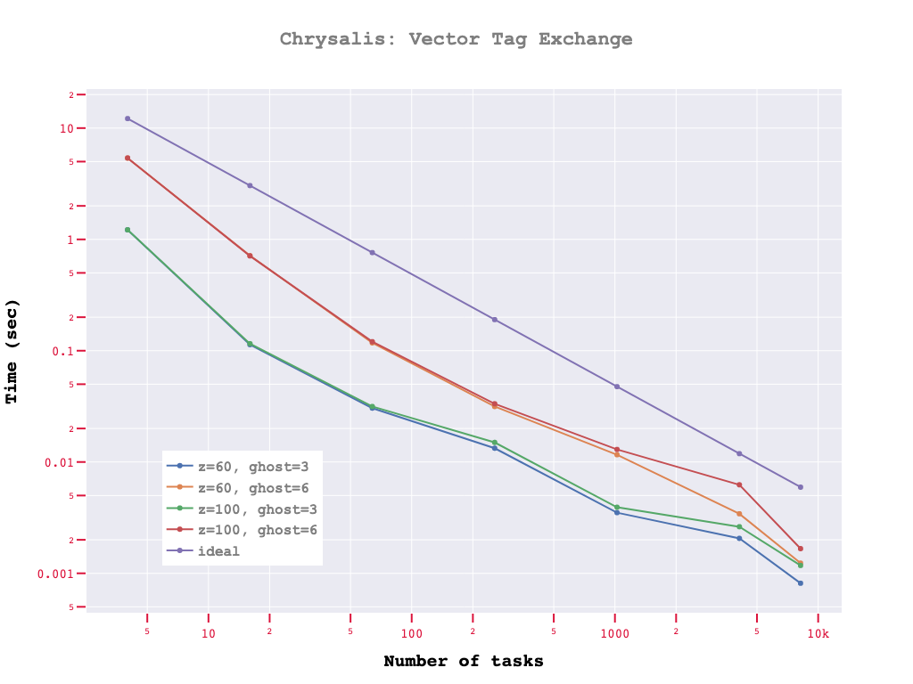
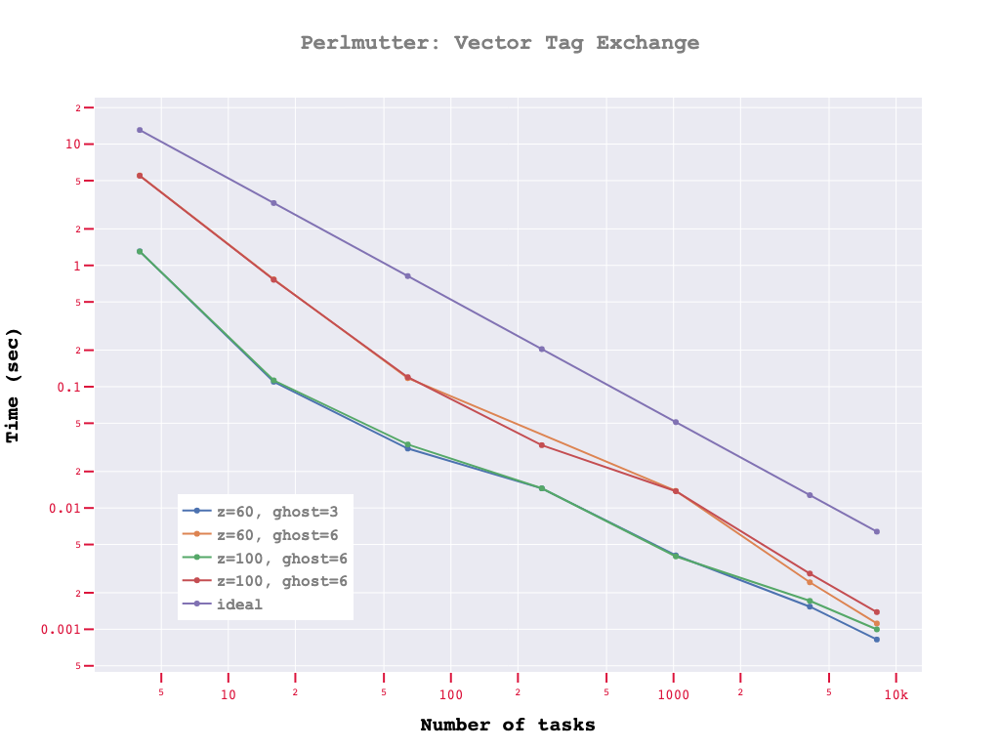

# ExchangeHalos Example
 
This [MOAB](https://bitbucket.org/fathomteam/moab) based MPI example program shows the use case for performing tag data exchange between parallel processors in order to sync data on shared entities. We define both scalar and vector variables on the mesh as tags, and depending on the requested number of ghost (or halo) layers, the field exchange is performed and communication time is measured.

 ## Workflow

 - Initialize MPI and instantiates MOAB
 - Gets user options: Input mesh file name, vector tag length, ghost layer size etc
 - Create the root and partition sets
 - Instantiate ParallelComm and read the mesh file in parallel using appropriate options
 - Create the required number of ghost layers as requested by the user (default = 3)
 - Get 2D MPAS polygonal entities in the mesh and filter to get only the "owned" entities
 - Create two tags: scalar_variable (single data/cell) and vector_variable (multiple data/cell)
 - Set tag data using analytical functions for both scalar and vector fields on owned entities
 - Exchange shared entity information and tags between processors
	 - If debugging is turned on, store mesh file and tag on root process (will not contain data on shared entities)
	 - Perform exchange of scalar tag data on shared entities
	 - Perform exchange of vector tag data on shared entities
 - If debugging is turned on, store mesh file and tag on root process (will now contain data on *all* entities)
 - Destroy the MOAB instance and finalize MPI

 **To run:**  

    mpiexec -n np ./ExchangeHalos --input <mpas_mesh_file> --nghosts <ghostlayers> --vtaglength <vector component size> --nexchanges <number of exchange runs>

**Example:**

    mpiexec -n 16 ./ExchangeHalos --input data/default_mesh_holes.h5m --nghosts 3 --vtaglength 100

***

## Performance Results

Here is the vector halo-exchange performance on running the example using a 3.5M cell MPAS file on two different LCF machines.

The communication kernels are scaling well up to 8192 processes on both machine. Need to increase problem and task size to get a better handle on performance at solver limits.

## NOTE:

`--debug` option can be added to write out extra files in h5m format to visualize some outputs (written from root task only)

## Relevant Links

[MOAB Repository](https://bitbucket.org/fathomteam/moab)

[MOAB Documentation](https://web.cels.anl.gov/projects/sigma/docs/moab/index.html)

[MOAB Webpage](https://sigma.mcs.anl.gov/moab-library/)

## Contact

Vijay Mahadevan
